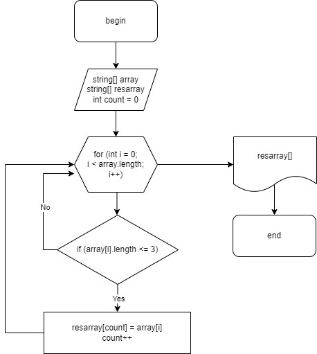
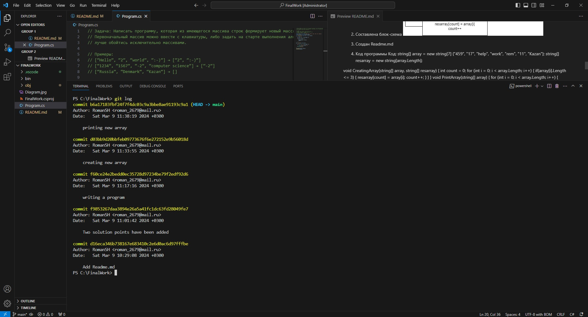

# Итоговая контрольная работа по основному блоку

Задача алгоритмически не самая сложная, однако для полноценного выполнения проверочной работы необходимо:

1. Создать репозиторий на GitHub
2. Нарисовать блок-схему алгоритма (можно обойтись блок-схемой основной содержательной части, если вы выделяете её в отдельный метод)
3. Снабдить репозиторий оформленным текстовым описанием решения (файл README.md)
4. Написать программу, решающую поставленную задачу
5. Использовать контроль версий в работе над этим небольшим проектом (не должно быть так, что всё залито одним коммитом, как минимум этапы 2, 3, и 4 должны быть расположены в разных коммитах)

Задача: Написать программу, которая из имеющегося массива строк формирует новый массив из строк, длина которых меньше, либо равна 3 символам. Первоначальный массив можно ввести с клавиатуры, либо задать на старте выполнения алгоритма. При решении не рекомендуется пользоваться коллекциями, лучше обойтись исключительно массивами.

Примеры:
[“Hello”, “2”, “world”, “:-)”] → [“2”, “:-)”]
[“1234”, “1567”, “-2”, “computer science”] → [“-2”]
[“Russia”, “Denmark”, “Kazan”] → []

# РЕШЕНИЕ

1. Создан репозиторий на GitHub

2. Составлена блок-схема 

3. Создан Readme.md

4. Код программы
Код: string[] array = new string[7] {"459", "17", "help", "work", "rem", "11", "Kazan"};
string[] resarray = new string[array.Length];

void CreatingArray(string[] array, string[] resarray)
{
    int count = 0;
    for (int i = 0; i < array.Length; i++)
    {
    if(array[i].Length <= 3)
        {
        resarray[count] = array[i];
        count++;
        }
    }
}
void PrintArray(string[] array)
{
    for (int i = 0; i < array.Length; i++)
    {
        Console.Write($"{array[i]} ");
    }
    Console.WriteLine();
}

CreatingArray(array, resarray);
PrintArray(resarray);

5. Коммиты 